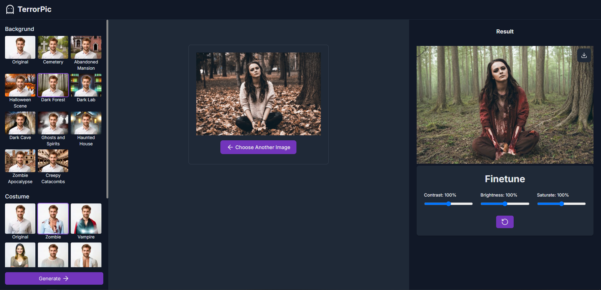

# TerrorPic

Unleash the horror, transform your photos into spine-chilling masterpieces with our AI-powered photo editor.



## Getting Started

First, set the environment variables, rename the .env.template file to .evn, and set the environment variables:

```bash
NEXT_PUBLIC_CLOUDINARY_CLOUD_NAME="<Your Cloud Name>"
NEXT_PUBLIC_CLOUDINARY_API_KEY="<Your API Key>"
CLOUDINARY_API_SECRET="<Your API Secret>
```

Second, install the project dependencies:

```bash
pnpm install
```

Third, run the development server:

```bash
pnpm dev
```

Open [http://localhost:3000](http://localhost:3000) with your browser to see the result.
